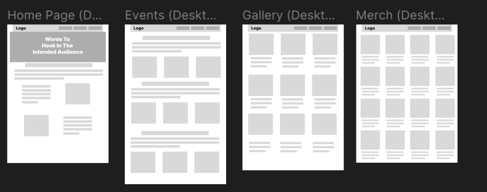
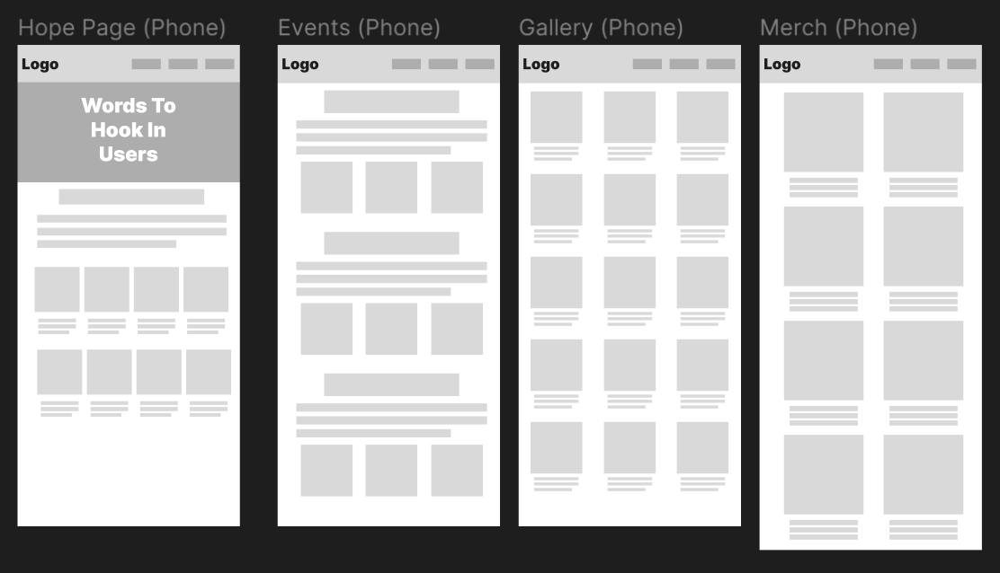

# Project 3: Festival For A Cause: By Donovan Lee

## Overview

Have you ever sought entertaining experiences for education? Want to push the boundaries and borders between what's entertaining and what's educational? This website is delving deep into those questions and even blurring the lines between the two aspects of an activity. Expect to view the site in many ways, through many screen aspects, from the larger screens of PCs, to the smaller screens of the phones. Even with the orientation of the device you may use to view the site, we welcome you to explore the site. Scroll around the site and view its many aspects. From the products to the events for the festival, we make sure everything is legible and understandable for many users on varying amounts of platforms.

Welcome to the "Edutainment To A Higher Degree" festival, where we focus on your views on entertainment, while also trying to provide a sense of education to our many attractions. Built off an old amusement park abandoned years ago, now, we refurbished the attractions to appeal to as many people as possible, making sure to push the site's understandability and purpose to many.

## Our Goal

Our goal for this site is to push forth a charity to aid in the difficulty in low-income students to attend a higher education. Many higher education have a great difficulty in attending to, with their high prices and low acceptance rates. Here at Edutainment To A Higher Degree, we ensure you can be accepted to your desired college. The sponsor of this event is "One Million Degrees", an Illinois-based charity with a focus on helping low-income students get into their desired community college.

## Our Advertising 

Look around for our advertising posters and billboards to help give a basic understanding to our festival.

## Thought Processes And Wireframing

Here is the wireframes for the website:

Both have an emphasis with the ratio of the screen of the device chosen.

Link To The Whole Wireframe:

https://www.figma.com/file/jtDBPaSk3whPmJT9ZPYJh1/lee_project3_wireframes?type=design&node-id=0%3A1&mode=design&t=oJ8qjU7yLMTSQkdy-1

## Acknoledgements

The photos used in this project are made using Craiyon and are mostly used to help get a sense on how the festival works.

Other images are made by me personally.

Google Drive Folder Full Of These Images: 

https://drive.google.com/drive/folders/1sF9LM4dVvklrQPVjyEybnocHbkset8Wr?usp=sharing

The AI Image Generator Used For This:

https://www.craiyon.com/